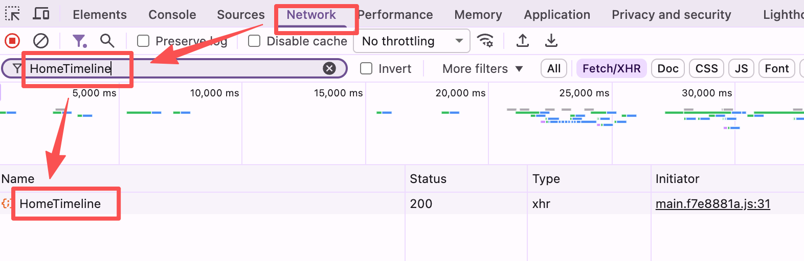
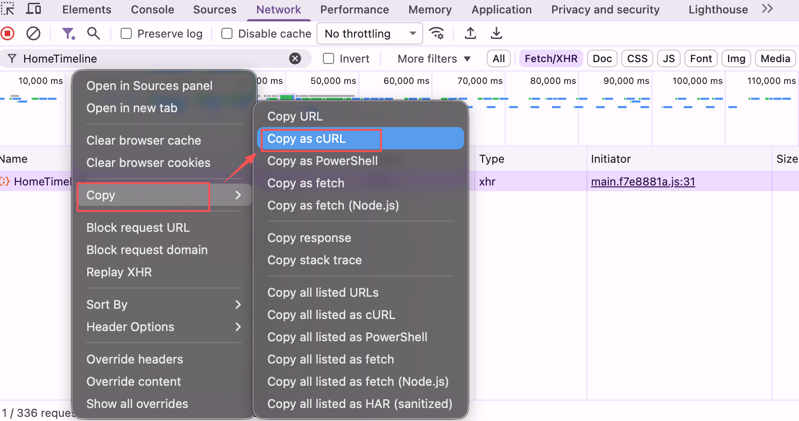
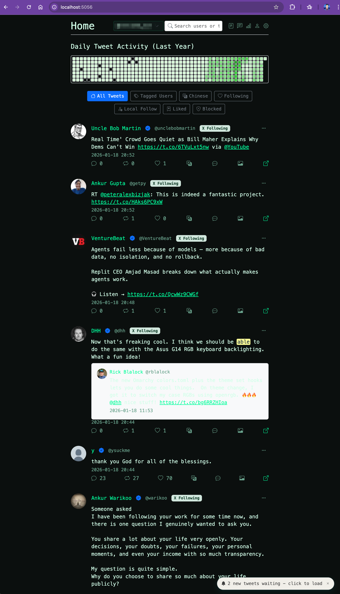

# x-go Releases

This repository hosts release assets and the installer script for xcli.

## Install (latest)

Linux/macOS (requires curl or wget):

```sh
curl -fsSL https://raw.githubusercontent.com/slyang-git/x-go-releases/main/install.sh | sh
```

The script installs `xcli` to `/usr/local/bin` (uses `sudo` if needed).


## Quick Start

After installation, run `xcli run` to start the system. This will launch X data scraping and a web interface at http://localhost:5056.

For first-time setup:

1. Log in to https://x.com in the Chrome browser.
2. Open Developer Tools (F12), switch to the Network tab.

3. Filter requests by the "HomeTimeline" keyword.


4. Copy the cURL command of the request.

5. Return to the http://localhost:5056 initialization page, paste the cURL command, and save to complete initialization.
6. After initialization, you can use the web interface to manage your X data.


## Database

After launch, the database is stored in the `~/xcli/` directory.

## Supported platforms

- Linux amd64
- macOS arm64
- Windows amd64

## Verify

```sh
xcli version
xcli help
```

## Uninstall

```sh
sudo rm -f /usr/local/bin/xcli # remove xcli 
sudo rm -rf ~/.xcli/* # remove sqlite database files
```
